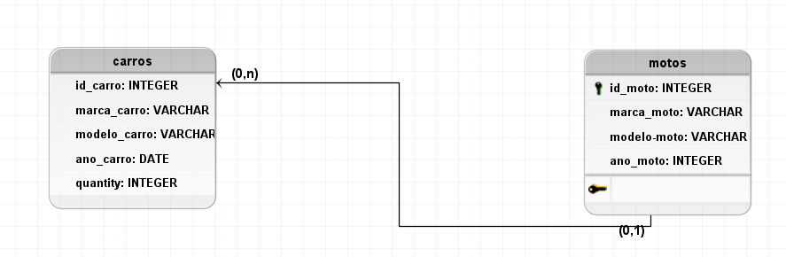

# Sistema de Concessionária de Veículos 🚗🏍️

Este é um sistema para gerenciamento de veículos (carros e motos) em uma concessionária. O sistema permite cadastrar, listar, editar e excluir veículos, além de consultar detalhes específicos de cada categoria (carros ou motos).

## 📋 Funcionalidades

### Gerenciamento de Veículos:
- **Cadastro de Veículos:**  
  Adicione veículos com informações como tipo (carro ou moto), marca, modelo, ano, preço, e status (disponível ou vendido).
- **Listagem de Veículos:**  
  Exiba todos os veículos cadastrados ou filtre por categoria (carros ou motos).
- **Detalhes do Veículo:**  
  Consulte informações detalhadas de um veículo específico.
- **Edição de Veículos:**  
  Atualize informações de um veículo existente.
- **Exclusão de Veículos:**  
  Remova veículos que não estão mais no estoque.

### Categorias de Veículos:
- **Carros:**  
  Inclua informações como quantidade de portas, tipo de combustível e tipo de câmbio.
- **Motos:**  
  Registre dados como cilindradas, tipo de motor e categoria (esportiva, custom, etc.).

## 🛠️ Tecnologias Utilizadas

- **Frontend:**  
  - HTML5  
  - Tailwind CSS  
- **Backend:**  
  - PHP  
- **Banco de Dados:**  
  - MySQL  

## 🗂️ Modelagem do Banco de Dados

